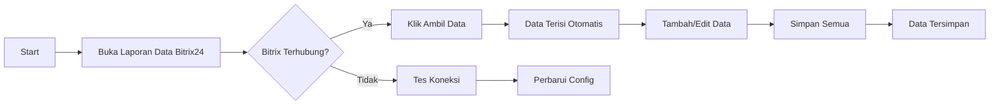

# 🔗 Panduan Integrasi Bitrix24 REST API

## 📋 Daftar Isi
1. [Persiapan](#persiapan)
2. [Konfigurasi API](#konfigurasi-api)
3. [Fitur Integrasi](#fitur-integrasi)
4. [Troubleshooting](#troubleshooting)

---

## 🚀 Persiapan

### Langkah 1: Login ke Bitrix24
1. Buka dashboard Bitrix24 Anda di `https://yourdomain.bitrix24.com`
2. Login dengan akun admin

### Langkah 2: Buat Webhook Incoming
1. Pergi ke **Settings** (Pengaturan)
2. Navigasi ke **Integration** → **Webhooks** → **Incoming webhooks**
3. Klik tombol **Create webhook**
4. Pilih **Webhook Key** yang sudah ada atau buat baru
5. Salin **Webhook Key** (terlihat seperti: `xxxxx/1/xxxxxxxxxxxxxxxxxx`)

---

## 🔑 Konfigurasi API

### File: `bitrixClient.ts`

Buka file `bitrixClient.ts` dan ganti PLACEHOLDER dengan konfigurasi Anda:

```typescript
// SEBELUM (⚠️ Belum Dikonfigurasi)
const BITRIX_API_URL = 'https://PLACEHOLDER_BITRIX_URL/rest/';
const BITRIX_WEBHOOK_KEY = 'PLACEHOLDER_WEBHOOK_KEY';

// SESUDAH (✓ Sudah Dikonfigurasi)
const BITRIX_API_URL = 'https://yourdomain.bitrix24.com/rest/';
const BITRIX_WEBHOOK_KEY = 'YOUR_WEBHOOK_KEY_HERE/1/YOUR_KEY_STRING';
```

### Contoh Konfigurasi Lengkap:
```typescript
const BITRIX_API_URL = 'https://kediaman-corp.bitrix24.com/rest/';
const BITRIX_WEBHOOK_KEY = '123abc456def/1/xyz123xyz123xyz123';
```

---

## 🎯 Fitur Integrasi

### 1. **Tes Koneksi** 🧪
- Klik tombol "Tes Koneksi" di bagian atas halaman
- Status akan berubah menjadi:
  - ✓ **Hijau** = Terhubung
  - ✗ **Merah** = Tidak terhubung

### 2. **Sinkronisasi Data** 📥
- Jika Bitrix24 terhubung, tombol "Ambil Data dari Bitrix24" akan aktif
- Klik tombol untuk mengambil semua deals dari Bitrix24
- Data akan otomatis terisi ke tabel input

### 3. **Data yang Disinkronisasi** 📊
Data berikut akan diambil dari Bitrix24 Deals:
```
- ID Bitrix       (dari Bitrix24 Deal ID)
- Nama            (dari Deal Title)
- Status          (dari Deal Stage)
- No. Telp        (kosong - ambil dari Contact jika perlu)
- Keterangan      (kosong - silakan isi manual)
```

### 4. **API Methods yang Tersedia**

#### a. **getDeals(filter?, limit?)**
Mendapatkan daftar deals
```typescript
import * as bitrixClient from './bitrixClient';

// Dapatkan 50 deals terakhir
const deals = await bitrixClient.getDeals();

// Dapatkan deals dengan filter
const deals = await bitrixClient.getDeals({
    STAGE_ID: 'WON',
    DATE_CREATE: '>=' + new Date().toISOString()
});
```

#### b. **createDeal(dealData)**
Membuat deal baru
```typescript
const result = await bitrixClient.createDeal({
    TITLE: 'Deal Baru dari Laporan',
    COMPANY_ID: '123',
    STAGE_ID: 'NEW',
    OPPORTUNITY: '50000'
});
console.log('Deal ID:', result.ID);
```

#### c. **updateDeal(dealId, dealData)**
Update deal yang sudah ada
```typescript
const updated = await bitrixClient.updateDeal('456', {
    TITLE: 'Nama Deal Terbaru',
    STAGE_ID: 'IN_PROGRESS'
});
```

#### d. **getContacts(filter?, limit?)**
Mendapatkan daftar kontak
```typescript
const contacts = await bitrixClient.getContacts();
```

#### e. **getLeads(filter?, limit?)**
Mendapatkan daftar leads
```typescript
const leads = await bitrixClient.getLeads();
```

#### f. **getCompanies(filter?, limit?)**
Mendapatkan daftar perusahaan
```typescript
const companies = await bitrixClient.getCompanies();
```

---

## 🔄 Alur Kerja Integrasi

### Skenario 1: Input Manual + Sync dari Bitrix



### Skenario 2: Auto-Sync Deal ke Local

Jika Anda ingin fitur auto-sync saat membuka halaman, update `useEffect`:

```typescript
useEffect(() => {
    const autoSync = async () => {
        if (bitrixConnectionStatus === 'connected') {
            await handleSyncFromBitrix();
        }
    };
    autoSync();
}, [bitrixConnectionStatus]);
```

---

## ⚙️ Environment Variables (Opsional)

Untuk keamanan lebih baik, gunakan environment variables:

### 1. Update `bitrixClient.ts`:
```typescript
const BITRIX_API_URL = import.meta.env.VITE_BITRIX_URL || 'https://PLACEHOLDER_BITRIX_URL/rest/';
const BITRIX_WEBHOOK_KEY = import.meta.env.VITE_BITRIX_WEBHOOK_KEY || 'PLACEHOLDER_WEBHOOK_KEY';
```

### 2. Buat file `.env.local`:
```
VITE_BITRIX_URL=https://yourdomain.bitrix24.com/rest/
VITE_BITRIX_WEBHOOK_KEY=YOUR_WEBHOOK_KEY_HERE/1/YOUR_KEY_STRING
```

### 3. Update `vite.config.ts` (jika perlu):
```typescript
export default {
  define: {
    'import.meta.env.VITE_BITRIX_URL': JSON.stringify(process.env.VITE_BITRIX_URL),
    'import.meta.env.VITE_BITRIX_WEBHOOK_KEY': JSON.stringify(process.env.VITE_BITRIX_WEBHOOK_KEY),
  },
}
```

---

## 🐛 Troubleshooting

### Problem 1: ✗ Bitrix24 Tidak Terhubung

**Penyebab:**
- BITRIX_API_URL salah
- BITRIX_WEBHOOK_KEY tidak valid
- Koneksi internet bermasalah

**Solusi:**
1. Periksa kembali format URL: `https://yourdomain.bitrix24.com/rest/`
2. Periksa webhook key di Bitrix24 Settings
3. Test dengan curl:
```bash
curl -X POST https://yourdomain.bitrix24.com/rest/crm.deal.list/YOUR_KEY \
  -H "Content-Type: application/json" \
  -d '{"limit": 1}'
```

### Problem 2: Error 401 atau 403

**Penyebab:**
- Webhook key expired
- Webhook key tidak memiliki permission

**Solusi:**
1. Buat webhook key baru
2. Pastikan webhook memiliki akses ke CRM

### Problem 3: CORS Error

**Penyebab:**
- Browser blocking request dari domain berbeda

**Solusi:**
- Update bitrixClient untuk menggunakan proxy atau CORS handler
- Atau deploy backend untuk handle API requests

### Problem 4: Tidak Ada Data Terambil

**Penyebab:**
- Tidak ada deals di Bitrix24
- Filter tidak cocok

**Solusi:**
1. Pastikan Bitrix24 Anda memiliki deals
2. Update filter di `getDeals()`:
```typescript
const deals = await bitrixClient.getDeals({}, 100); // Ambil 100 deals
```

---

## 📚 Referensi Dokumentasi

- [Bitrix24 REST API Docs](https://apidocs.bitrix24.com/)
- [CRM Methods](https://apidocs.bitrix24.com/api-reference/crm/index.html)
- [Deals](https://apidocs.bitrix24.com/api-reference/crm/deals/deals.html)
- [Contacts](https://apidocs.bitrix24.com/api-reference/crm/contacts/contacts.html)
- [Leads](https://apidocs.bitrix24.com/api-reference/crm/leads/leads.html)

---

## 📝 Checklist Setup

- [ ] Sudah membuat Webhook Incoming di Bitrix24
- [ ] Sudah menyalin Webhook Key
- [ ] Sudah update `BITRIX_API_URL` di `bitrixClient.ts`
- [ ] Sudah update `BITRIX_WEBHOOK_KEY` di `bitrixClient.ts`
- [ ] Sudah tes koneksi dari UI
- [ ] Sudah berhasil ambil data dari Bitrix24

---

## 💡 Tips & Tricks

### 1. Test API Secara Manual
```typescript
// Di browser console
import * as bitrix from './bitrixClient.ts';
const deals = await bitrix.getDeals({}, 10);
console.log(deals);
```

### 2. Custom Filter Deals
```typescript
// Ambil deals dengan stage tertentu
const deals = await bitrixClient.getDeals({
    STAGE_ID: ['WON', 'IN_PROGRESS'],
    DATE_CREATE: '>2024-01-01'
});
```

### 3. Extend API Methods
Tambahkan method baru di `bitrixClient.ts`:
```typescript
export async function getDealsWithContacts(filter = {}) {
    const deals = await getDeals(filter);
    // Enhance deals dengan contact info
    return deals;
}
```

---

**Pertanyaan atau Issue?** Periksa console browser untuk error messages yang lebih detail.
